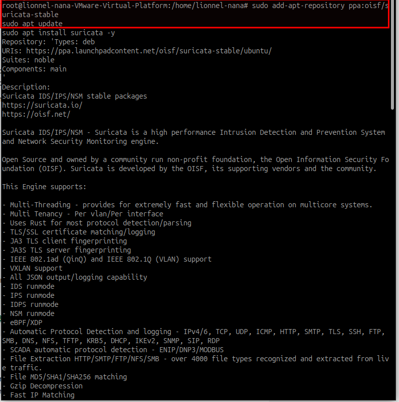
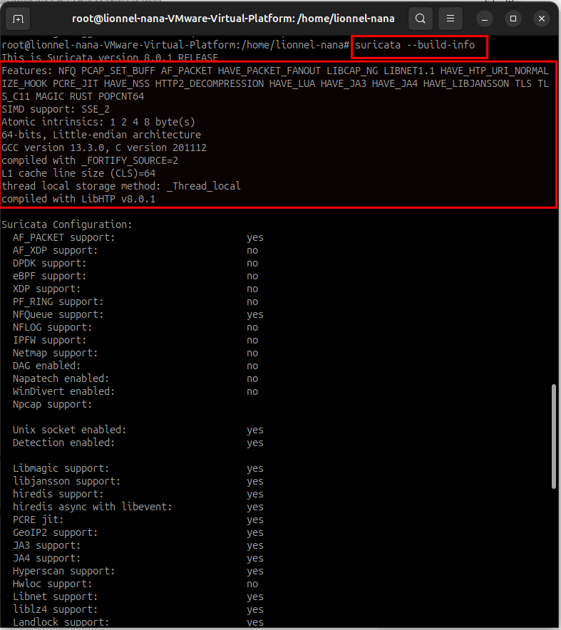
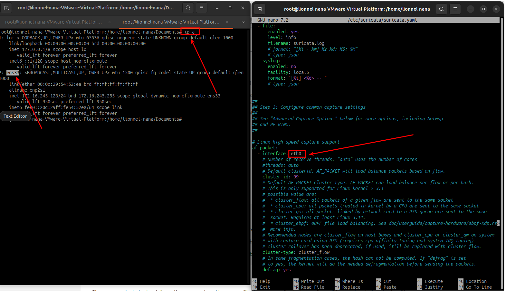

[⬅ Retour à l'accueil](README.md)
<br/>

# Installer Suricata sur Ubuntu, suivez ces étapes :

1. **Mettre à jour le système** :
   ```bash
   sudo apt update && sudo apt upgrade -y
   ```

2. **Installer Suricata** :
   - Pour la dernière version stable, ajoutez le PPA de l'OISF (Open Information Security Foundation) :
     ```bash
     sudo add-apt-repository ppa:oisf/suricata-stable
     sudo apt update
     sudo apt install suricata -y
     ```
   - Alternativement, installez la version des dépôts par défaut d’Ubuntu (peut être plus ancienne) :
     ```bash
     sudo apt install suricata -y
     ```
     
    
     

3. **Vérifier l’installation** :
   ```bash
   suricata --build-info
   ```
   Cela affiche la version installée et les détails de la compilation.
     
    

4. **Configurer Suricata** (facultatif, pour une configuration de base) :
   - Modifiez le fichier de configuration :
     ```bash
     sudo nano /etc/suricata/suricata.yaml
     ```
   - Assurez-vous que l’interface réseau et les règles sont correctement définies. Par exemple, configurez l’interface :
     ```yaml
     af-packet:
       - interface: ens33
     ```
   - Mettez à jour les règles :
     ```bash
     sudo suricata-update
     ```
     
    

5. **Démarrer Suricata** :
   - Activez et démarrez le service :
     ```bash
     sudo systemctl enable suricata
     sudo systemctl start suricata
     ```
   - Vérifiez l’état :
     ```bash
     sudo systemctl status suricata
     ```

6. **Tester Suricata** :
   - Exécutez en mode test pour vérifier la configuration :
     ```bash
     sudo suricata -c /etc/suricata/suricata.yaml -i ens33
     ```

**Remarques** :
- Remplacez `ens33` par votre interface réseau réelle (vérifiez avec `ifconfig` ou `ip a`).


<br/>

---

<br/>

## Configurer Suricata afin d'envoyer les journaux à `syslog-ng` 

1. **Vérifiez que Suricata et syslog-ng sont installés** :
   - Assurez-vous que Suricata est installé (voir les instructions précédentes).
   - Installez `syslog-ng` si ce n'est pas déjà fait :
     ```bash
     sudo apt update
     sudo apt install syslog-ng -y
     ```

2. **Configurer Suricata pour envoyer les journaux à syslog** :
   - Modifiez le fichier de configuration de Suricata :
     ```bash
     sudo nano /etc/suricata/suricata.yaml
     ```
   - Localisez ou ajoutez la section `outputs` et activez la sortie `syslog`. Assurez-vous qu'elle ressemble à ceci :
     ```yaml
     outputs:
       - syslog:
           enabled: yes
           facility: local5
           level: Info
     ```
     - `facility` : Utilisez `local5` (ou un autre comme `local0`–`local7`) pour distinguer les journaux de Suricata.
     - `level` : Définissez sur `Info` ou ajustez selon le niveau de verbosité souhaité (par exemple, `Debug`, `Warning`).

3. **Configurer syslog-ng pour gérer les journaux de Suricata** :
   - Modifiez le fichier de configuration de `syslog-ng` :
     ```bash
     sudo nano /etc/syslog-ng/syslog-ng.conf
     ```
   - Ajoutez un bloc de configuration pour traiter les journaux de Suricata. Par exemple :
     ```conf
     # Définir une source pour les journaux de Suricata
     source s_suricata {
         system();
     };

     # Définir une destination (par exemple, un fichier de journal spécifique)
     destination d_suricata {
         file("/var/log/suricata/suricata.log");
     };


     # Définir un filtre sur local5
    filter f_suricata{ facility(local5) };

     # Définir un chemin de journal pour connecter la source et la destination
     log {
         source(s_suricata);
         filter(f_suricata);
         destination(d_elasticsearch_http);
     };
     ```
   - Assurez-vous que le répertoire des journaux existe :
     ```bash
     sudo mkdir -p /var/log/suricata
     sudo chown syslog:adm /var/log/suricata
     ```

4. **Redémarrez les services pour appliquer les modifications** :
   - Rechargez `syslog-ng` :
     ```bash
     sudo systemctl restart syslog-ng
     ```
   - Redémarrez Suricata :
     ```bash
     sudo systemctl restart suricata
     ```

5. **Vérifiez les journaux** :
   - Vérifiez que les journaux de Suricata sont écrits dans le fichier spécifié :
     ```bash
     sudo tail -f /var/log/suricata/suricata.log
     ```
   - Sinon, vérifiez les journaux système si non redirigés vers un fichier spécifique :
     ```bash
     sudo tail -f /var/log/syslog
     ```
   - Assurez-vous que Suricata génère des journaux en simulant du trafic réseau ou en exécutant Suricata en mode test :
     ```bash
     sudo suricata -c /etc/suricata/suricata.yaml -i eth0
     ```
     
     

6. **Optionnel : Affiner syslog-ng** :
   - Pour filtrer des événements spécifiques de Suricata, modifiez `syslog-ng.conf` avec un filtre. Par exemple :
     ```conf
     filter f_suricata_alerts {
         facility(local5) and match("alert" value("MESSAGE"));
     };
     log {
         source(s_suricata);
         filter(f_suricata_alerts);
         destination(d_suricata);
     };
     ```
   - Redémarrez `syslog-ng` après les modifications :
     ```bash
     sudo systemctl restart syslog-ng
     ```
     

**Remarques** :
- Remplacez `ens33` par votre interface réseau réelle.
- Assurez-vous que la syntaxe de `suricata.yaml` et `syslog-ng.conf` est correcte pour éviter les échecs de service.
- Si les journaux n'apparaissent pas, vérifiez l'état des services :
  ```bash
  sudo systemctl status suricata
  sudo systemctl status syslog-ng
  ```

- Pour les journaux à fort volume, envisagez une rotation des journaux pour gérer l'espace disque.

<br/><br/>

[⬅ Retour à l'accueil](README.md)