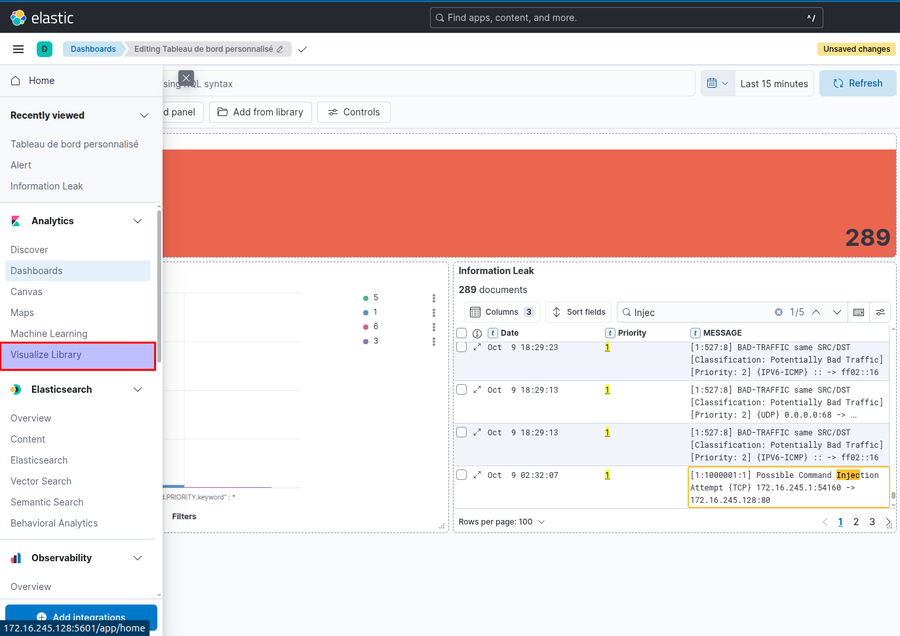
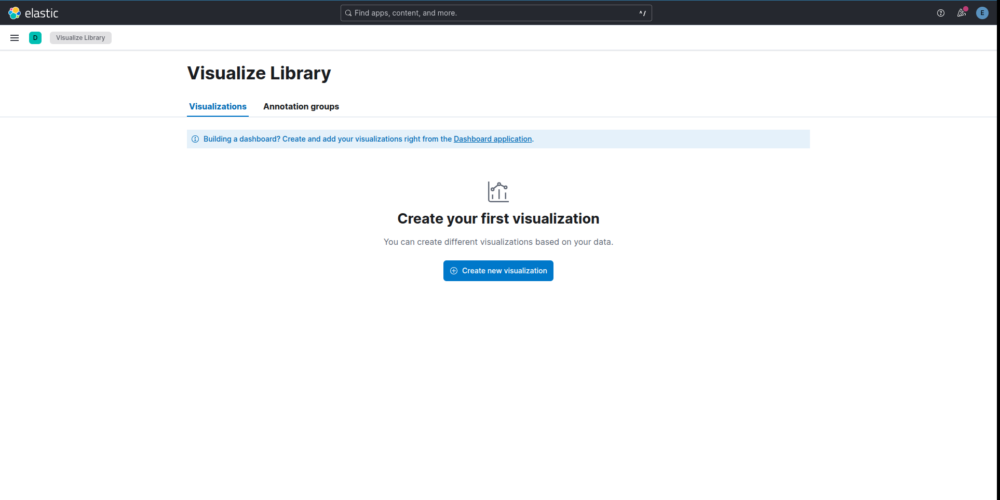
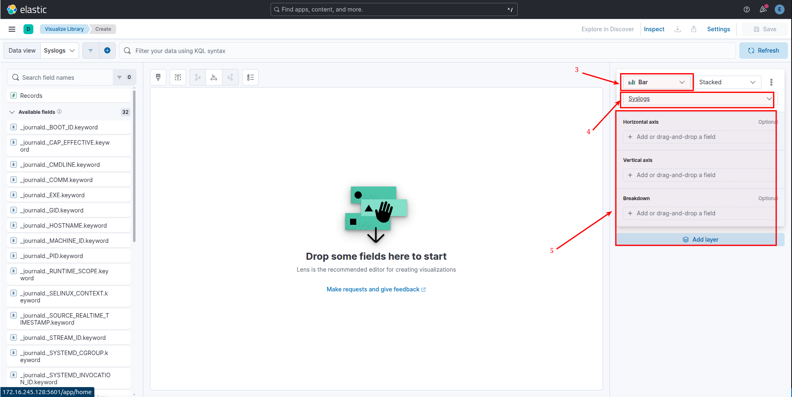
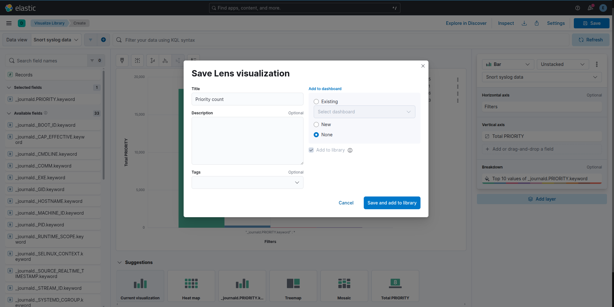
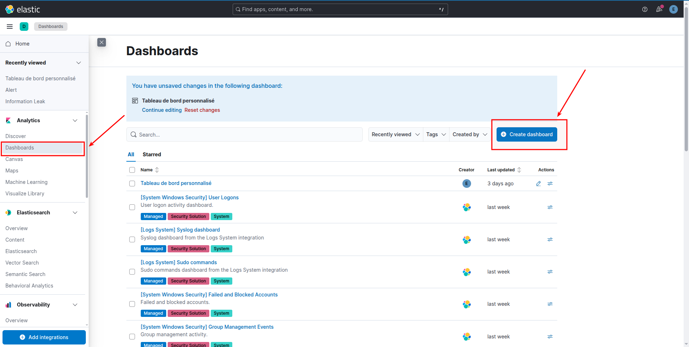
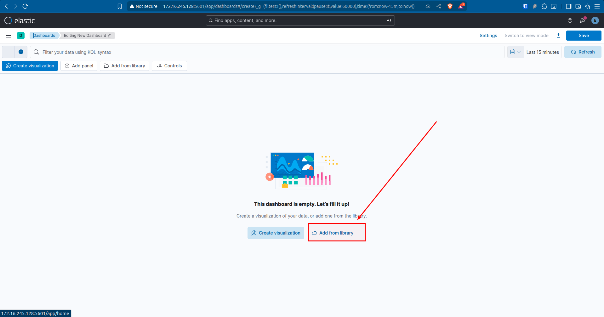
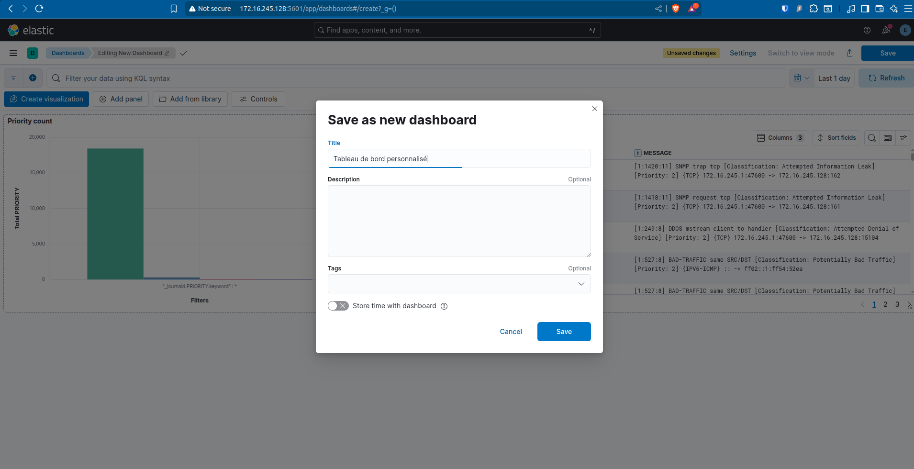
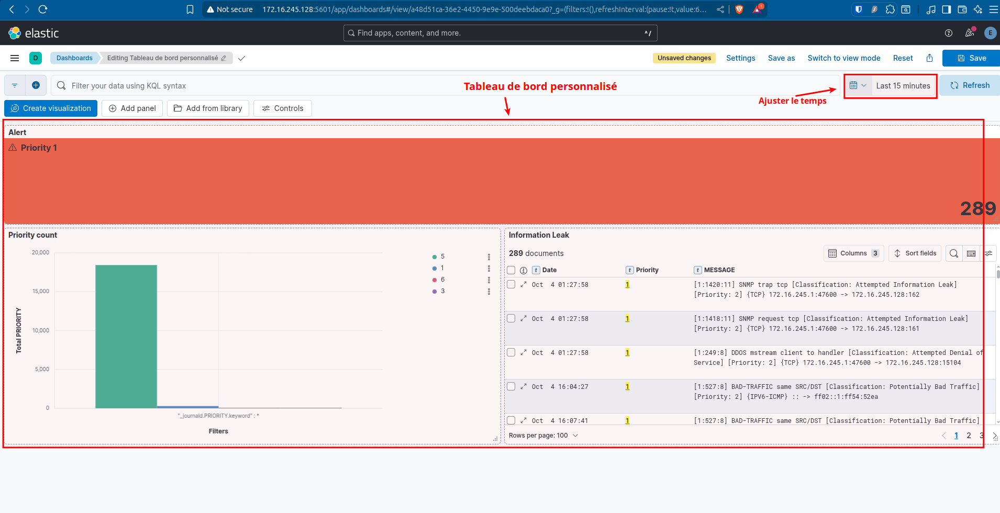

[⬅ Retour à l'accueil](README.md)
 

## 📊 Étape 4 : Création d’un Tableau de Bord dans Kibana

### ✅ Prérequis

* Avoir accès à Kibana via un navigateur (ex. : [http://localhost:5601](http://localhost:5601))
* Avoir des données indexées dans Elasticsearch
* Avoir créé un index pattern dans **Stack Management > Index Patterns**

---

### 1. 🔍 Créer une visualisation

1. Accédez à **Kibana > Visualize Library**

2. Cliquez sur **"Create visualization"**

3. Choisissez un type de visualisation :
   - 📈 Line, Bar, Pie, Heat map, etc.
   - 📋 **Data Table** (pour affichage en colonnes)

4. Sélectionnez l’**Index pattern** (ex. : `syslog-ng`)

5. Configurez la visualisation :
   - Ajoutez une métrique (ex. : Count)
   - Ajoutez une **Split rows** ou **Split columns** (par ex. `host`, `program`, etc.)

6. Cliquez sur **"Save and return"**

 

---

### 2. 🧩 Créer un nouveau tableau de bord

1. Allez dans **Kibana > Dashboard**

2. Cliquez sur **"Create new dashboard"**

3. Cliquez sur **"Add from library"**

4. Sélectionnez les visualisations que vous avez créées

5. Réorganisez les éléments par glisser-déposer

6. Cliquez sur **"Save"**
   - Donnez un nom au tableau de bord (ex. : `Tableau de bord Syslog`)
   - Cochez **"Store time with dashboard"** si vous voulez sauvegarder l'intervalle de temps

---

### 3. ⏱️ Ajuster la période de temps

1. En haut à droite, cliquez sur le sélecteur de dates
2. Choisissez une période (ex. : "Last 15 minutes", "Today", "This month", etc.)
3. Rafraîchissez automatiquement les données si besoin (Auto-refresh)

---

### 4. 🧪 Tester et partager

1. Vérifiez que les visualisations affichent bien les données attendues
2. Cliquez sur **"Share"** pour copier un lien public ou intégrer dans une iframe
3. Vous pouvez exporter le dashboard au format JSON (via API ou Dev Tools)

---

## 💡 Astuces

- Utilisez des filtres globaux pour affiner les résultats (champ `program`, `host`, `severity`, etc.)
- Ajoutez un **Search bar** pour filtrer dynamiquement par mots-clés
- Combinez plusieurs types de graphiques (camembert, histogramme, data table)

---

  
[⬅ Retour à l'accueil](README.md)
